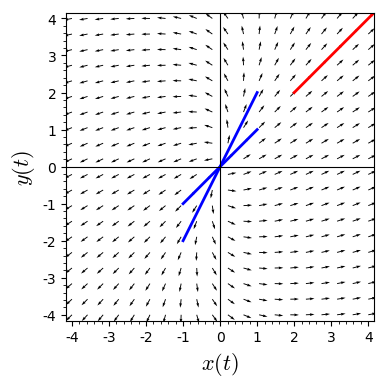
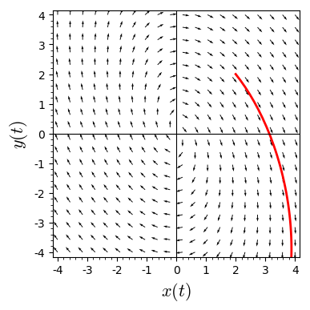
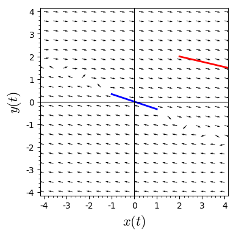
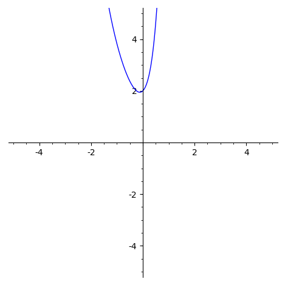
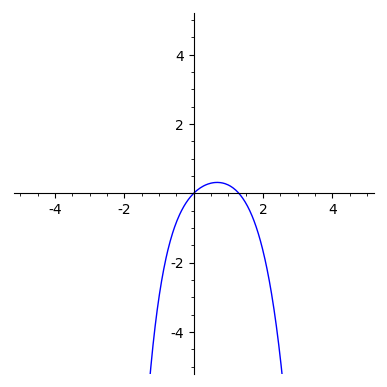
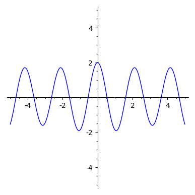

# Problem 1


```python
A = matrix([[4,-1],[2,1]])
u = A.eigenvalues()
T = A.eigenmatrix_right() [1]
show(A,u,T)
```


<html><script type="math/tex; mode=display">\newcommand{\Bold}[1]{\mathbf{#1}}\left(\begin{array}{rr}
4 & -1 \\
2 & 1
\end{array}\right) \left[3, 2\right] \left(\begin{array}{rr}
1 & 1 \\
1 & 2
\end{array}\right)</script></html>


```python
x, y, t = var('x y t')
F = [ 4*x - y, 2*x + y]
n = sqrt(F[0]^2 + F[1]^2)
p = plot_vector_field((F[0]/n, F[1]/n), (x, -4, 4), (y, -4, 4), aspect_ratio = 1)
P1 = desolve_system_rk4(F, [x, y], ics=[0, 2, 2], ivar = t, end_points = 5, step = 0.01)
S1 = [ [j, k] for i, j, k in P1]
# plot the solution
p += line(S1, thickness = 2, color = "red", axes_labels=['$x(t)$','$y(t)$'], xmin = -4, xmax = 4, ymin = -4, ymax = 4)
p += line([(1,1), (-1,-1)], thickness = 2) 
p += line([(1,2), (-1,-2)], thickness = 2)
p
```





# Problem 2


```python
A = matrix([[2,2],[-5,0]])
u = A.eigenvalues()
T = A.eigenmatrix_right() [1]
show(A,u,T)
```


<html><script type="math/tex; mode=display">\newcommand{\Bold}[1]{\mathbf{#1}}\left(\begin{array}{rr}
2 & 2 \\
-5 & 0
\end{array}\right) \left[1 - 3 \sqrt{-1}, 1 + 3 \sqrt{-1}\right] \left(\begin{array}{rr}
1 & 1 \\
-0.50000000000000000? - 1.5000000000000000? \sqrt{-1} & -0.50000000000000000? + 1.5000000000000000? \sqrt{-1}
\end{array}\right)</script></html>


```python
x, y, t = var('x y t')
F = [ 2*x + 2*y, -5*x + 0*y]
n = sqrt(F[0]^2 + F[1]^2)
p = plot_vector_field((F[0]/n, F[1]/n), (x, -4, 4), (y, -4, 4), aspect_ratio = 1)
P1 = desolve_system_rk4(F, [x, y], ics=[0, 2, 2], ivar = t, end_points = 5, step = 0.01)
S1 = [ [j, k] for i, j, k in P1]
# plot the solution
p += line(S1, thickness = 2, color = "red", axes_labels=['$x(t)$','$y(t)$'], xmin = -4, xmax = 4, ymin = -4, ymax = 4)
p
```





# Problem 3


```python
A = matrix([[4,9],[-1,-2]])
u = A.eigenvalues()
T = A.eigenmatrix_right() [1]
show(A,u,T)
```


<html><script type="math/tex; mode=display">\newcommand{\Bold}[1]{\mathbf{#1}}\left(\begin{array}{rr}
4 & 9 \\
-1 & -2
\end{array}\right) \left[1, 1\right] \left(\begin{array}{rr}
1 & 0 \\
-\frac{1}{3} & 0
\end{array}\right)</script></html>


```python
x, y, t = var('x y t')
F = [ 4*x + 9*y, -1*x - 2*y]
n = sqrt(F[0]^2 + F[1]^2)
p = plot_vector_field((F[0]/n, F[1]/n), (x, -4, 4), (y, -4, 4), aspect_ratio = 1)
P1 = desolve_system_rk4(F, [x, y], ics=[0, 2, 2], ivar = t, end_points = 5, step = 0.01)
S1 = [ [j, k] for i, j, k in P1]
# plot the solution
p += line(S1, thickness = 2, color = "red", axes_labels=['$x(t)$','$y(t)$'], xmin = -4, xmax = 4, ymin = -4, ymax = 4)
p += line([(1,-1/3), (-1,1/3)], thickness = 2)
p
```





# Problem 4


```python
t = var('t')
x = function('x')(t)
DE = diff(x,t,2) - 2*diff(x,t) - 3*x == 2*exp(2*t)
desolve(DE, [x,t])
```


    _K1*e^(3*t) + _K2*e^(-t) - 2/3*e^(2*t)


```python
t = var('t')
x = function('x')(t)
DE = diff(x,t,2) - 2*diff(x,t) - 3*x == 2*exp(2*t)
desolve(DE, [x,t], ics = [0,2,1])
```


    5/4*e^(3*t) - 2/3*e^(2*t) + 17/12*e^(-t)


```python
t = var('t')
x = function('x')(t)
DE = diff(x,t,2) - 2*diff(x,t) - 3*x == 2*exp(2*t)
desolve(DE, [x,t], ics = [0,2,1])
p = plot(desolve(DE, [x,t], ics = [0,2,1]), xmax = 5, xmin = -5, ymax = 5, ymin = -5, aspect_ratio = 1)
show(p)
```





# Problem 5


```python
t = var('t')
x = function('x')(t)
DE = diff(x,t,2) + diff(x,t) - 2*x == -1*exp(t)
desolve(DE, [x,t])
```


    _K2*e^(-2*t) + _K1*e^t - 1/9*(3*t - 1)*e^t


```python
t = var('t')
x = function('x')(t)
DE = diff(x,t,2) + diff(x,t) - 2*x == -1*exp(t)
desolve(DE, [x,t], ics = [0,0,1])
```


    -1/9*(3*t - 1)*e^t - 4/9*e^(-2*t) + 1/3*e^t


```python
t = var('t')
x = function('x')(t)
DE = diff(x,t,2) + diff(x,t) - 2*x == -1*exp(t)
desolve(DE, [x,t], ics = [0,0,1])
p = plot(desolve(DE, [x,t], ics = [0,0,1]), xmax = 5, xmin = -5, ymax = 5, ymin = -5, aspect_ratio = 1)
show(p)
```





# Problem 6


```python
t = var('t')
x = function('x')(t)
DE = diff(x,t,2) + 9*x == cos(2*t)
desolve(DE, [x,t])
```


    _K2*cos(3*t) + _K1*sin(3*t) + 1/5*cos(2*t)


```python
t = var('t')
x = function('x')(t)
DE = diff(x,t,2) + 9*x == cos(2*t)
desolve(DE, [x,t], ics = [0,2,0])
```


    9/5*cos(3*t) + 1/5*cos(2*t)


```python
t = var('t')
x = function('x')(t)
DE = diff(x,t,2) + 9*x == cos(2*t)
desolve(DE, [x,t], ics = [0,2,0])
p = plot(desolve(DE, [x,t], ics = [0,2,0]), xmax = 5, xmin = -5, ymax = 5, ymin = -5, aspect_ratio = 1)
show(p)
```





```python

```
