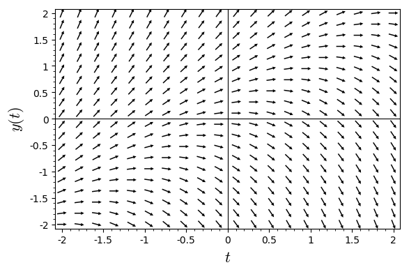
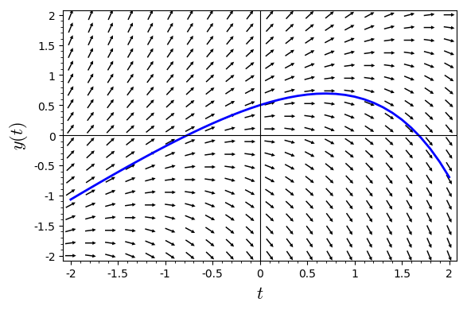

```python
# 5
x, t = var('x t')
f(x, t) = x - t
v = plot_slope_field(f, (t,-2, 2), (x,-2 ,2), headaxislength=3, headlength=3, axes_labels=['$t$','$y(t)$'])
v
```





```python
#7
x, t = var('x t')
f(x, t) = x - t
v = plot_slope_field(f, (t,-2, 2), (x,-2 ,2), headaxislength=3, headlength=3, axes_labels=['$t$','$y(t)$'])
v += desolve_rk4(f, x, ics=[0,.5], ivar=t, output='plot', end_points=[-2,2], thickness=2)
v.show(xmin = -2, xmax = 2, ymin = -2, ymax = 2)
```





```python
# 10
t = var('t')
y = function('y')(t)
v = function('v')(t)
t_start = 0
y_start = 1
v_start = 0
de1 = diff(y,t) == v
de2 = diff(v,t) == -2*v+y+2
sol = desolve_system([de1, de2], [y, v], ics=[t_start, y_start, v_start])
sol[0].show()
sol[1].show()
```


<html><script type="math/tex; mode=display">\newcommand{\Bold}[1]{\mathbf{#1}}y\left(t\right) = \frac{3}{2} \, {\left(\sqrt{2} \sinh\left(\sqrt{2} t\right) + 2 \, \cosh\left(\sqrt{2} t\right)\right)} e^{\left(-t\right)} - 2</script></html>


<html><script type="math/tex; mode=display">\newcommand{\Bold}[1]{\mathbf{#1}}v\left(t\right) = \frac{3}{2} \, \sqrt{2} e^{\left(-t\right)} \sinh\left(\sqrt{2} t\right)</script></html>


```python

```
