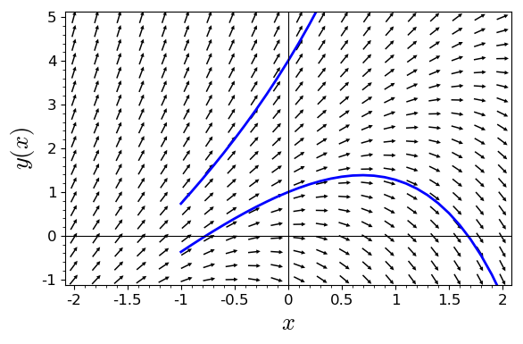
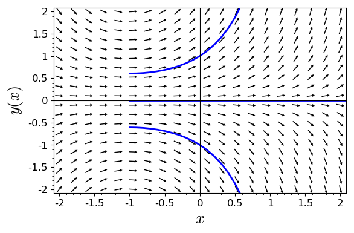
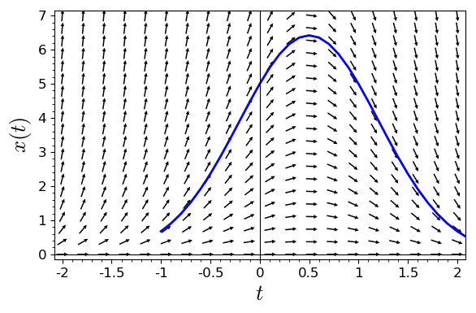
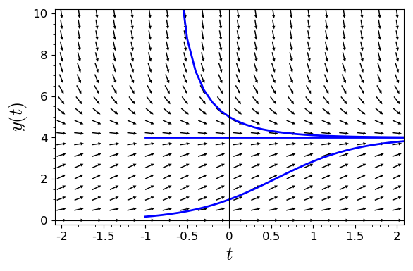
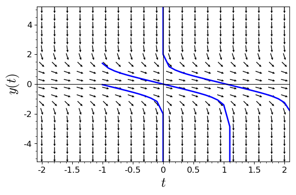

# Activity 1.3.1

### Part a


```python
x, y = var('x, y')
f(x, y) = y-2*x
p = plot_slope_field(f, (x,-2,2), (y,-1,5), headaxislength=3, headlength=3, axes_labels=['$x$','$y(x)$'], fontsize=12)
p += desolve_rk4(f, y, ics=[0,4], ivar=x, output='plot', end_points=[-1,5], thickness=2)
p += desolve_rk4(f, y, ics=[0,1], ivar=x, output='plot', end_points=[-1,5], thickness=2)
p.show(xmin = -2, xmax = 2, ymin = -1, ymax = 5)  #set the size of the plot window
```





### Part b


```python
x, y = var('x, y')
f(x, y) = y*(1+x)
p = plot_slope_field(f, (x,-2,2), (y,-2,2), headaxislength=3, headlength=3, axes_labels=['$x$','$y(x)$'], fontsize=12)
p += desolve_rk4(f, y, ics=[0,1], ivar=x, output='plot', end_points=[-1,5], thickness=2)
p += desolve_rk4(f, y, ics=[0,0], ivar=x, output='plot', end_points=[-1,5], thickness=2)
p += desolve_rk4(f, y, ics=[0,-1], ivar=x, output='plot', end_points=[-1,5], thickness=2)
p.show(xmin = -2, xmax = 2, ymin = -2, ymax = 2)  #set the size of the plot window
```





### Part c


```python
x, t = var('x, t')
f(x, t) = x - 2*t*x
p = plot_slope_field(f, (t,-2,2), (x,0,7), headaxislength=3, headlength=3, axes_labels=['$t$','$x(t)$'], fontsize=12)
p += desolve_rk4(f, x, ics=[0,5], ivar=t, output='plot', end_points=[-1,5], thickness=2)
p.show(xmin = -2, xmax = 2, ymin = 0, ymax = 7)  #set the size of the plot window
```





### Part d


```python
t, y = var('t, y')
f(t, y) = 2*y*(1-y/4)
p = plot_slope_field(f, (t,-2,2), (y,0,10), headaxislength=3, headlength=3, axes_labels=['$t$','$y(t)$'], fontsize=12)
p += desolve_rk4(f, y, ics=[0,1], ivar=x, output='plot', end_points=[-1,5], thickness=2)
p += desolve_rk4(f, y, ics=[0,4], ivar=x, output='plot', end_points=[-1,5], thickness=2)
p += desolve_rk4(f, y, ics=[0,5], ivar=x, output='plot', end_points=[-1,5], thickness=2)
p.show(xmin = -2, xmax = 2, ymin = 0, ymax = 10)  #set the size of the plot window
```





### Part e


```python
t, y = var('t, y')
f(t, y) = -1 - y^4
p = plot_slope_field(f, (t,-2,2), (y,-5,5), headaxislength=3, headlength=3, axes_labels=['$t$','$y(t)$'], fontsize=12)
p += desolve_rk4(f, y, ics=[0,2], ivar=x, output='plot', end_points=[-1,5], thickness=2)
p += desolve_rk4(f, y, ics=[0,0], ivar=x, output='plot', end_points=[-1,5], thickness=2)
p += desolve_rk4(f, y, ics=[0,-2], ivar=x, output='plot', end_points=[-1,5], thickness=2)
p.show(xmin = -2, xmax = 2, ymin = -5, ymax = 5)  #set the size of the plot window
```





```python

```
