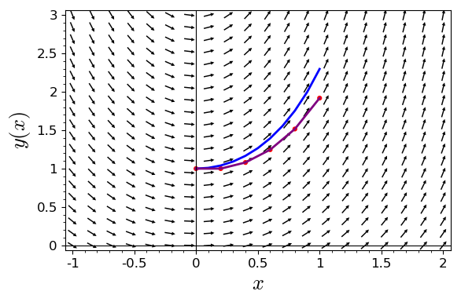

```python
t_min = 0 #the starting time for t
t_max = 1 #the ending time for t
h = 0.2 #the step size (must evenly divide the interval)
num = (t_max-t_min)/h #how many steps do we need?
x_vals = [RR(i)/num for i in range(num+1)] #this python code creates a list [0,0.2,0.4,0.6,0.8.1]
Y_vals = [1] #just like in the spreadsheet, we start with the first Y value
for x_i in x_vals:
    Y_prime = x_i + x_i*Y_vals[-1] #Y' = x + x*y
    Y_vals.append(Y_vals[-1] + h*Y_prime) #Y_{k+1} = Y_k + h * Y' 
zip(x_vals, Y_vals) #zip takes two lists of equal size and zips them into pairs
```


    [(0.000000000000000, 1),
     (0.200000000000000, 1.00000000000000),
     (0.400000000000000, 1.08000000000000),
     (0.600000000000000, 1.24640000000000),
     (0.800000000000000, 1.51596800000000),
     (1.00000000000000, 1.91852288000000)]


```python
x, y = var('x, y') #declare variables
f(x, y) = x + x*y #the right-hand-side of the differential equation
#plot the slope field
p = plot_slope_field(f, (x,-1,2), (y,0,3), headaxislength=3, headlength=3, axes_labels=['$x$','$y(x)$'], fontsize=12)
#add the solution to the differential equation (and iniital conditions) to the plot
p += desolve_rk4(f, y, ics=[0,1], ivar=x, output='plot', end_points=[0,1], thickness=2)
#add our approximation to the plot as purple line segments and red dots
p += list_plot(zip(x_vals, Y_vals), plotjoined=True, color='purple', thickness=2)
p += points(zip(x_vals, Y_vals), color = 'red', size = 20)
#show the plot
p.show(xmin = -1, xmax = 2, ymin = 0, ymax = 3)  #set the size of the plot window
```





```python

```
