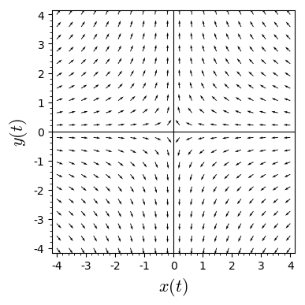
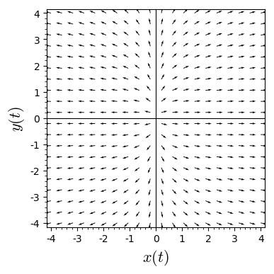
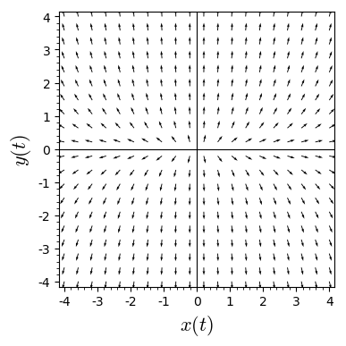
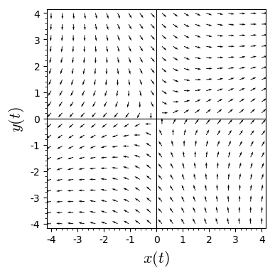
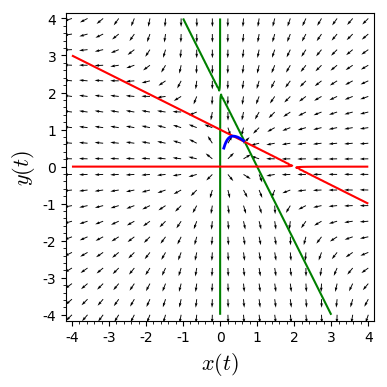

# Activities 2.2.1 & 2.2.2
Plot direction fields for each of the following systems of differential equations in the $xy$-plane.

### Part (a) 

\begin{aligned} x' &= -3x\\ y' &= 4y \end{aligned}


```python
x, y, t = var('x y t')
F = [-3*x, 4*y]
n = sqrt(F[0]^2 + F[1]^2)
F_unit = [F[0]/n, F[1]/n] #set all vectors in the vector field to be same length
p = plot_vector_field(F_unit, (x,-4,4), (y,-4,4), axes_labels=['$x(t)$','$y(t)$'], xmax = 4, xmin = -4, ymax = 4, ymin = -4, aspect_ratio=1)
p
```





### Part (b)
\begin{aligned} x' &= 2x\\ y' &= \frac{y}{2} \end{aligned}


```python
x, y, t = var('x y t')
F = [2*x, y/2]
n = sqrt(F[0]^2 + F[1]^2)
F_unit = [F[0]/n, F[1]/n] #set all vectors in the vector field to be same length
p = plot_vector_field(F_unit, (x,-4,4), (y,-4,4), axes_labels=['$x(t)$','$y(t)$'], xmax = 4, xmin = -4, ymax = 4, ymin = -4, aspect_ratio=1)
p
```





### Part (c)
\begin{aligned} x' &= -3x\\ y' &= \frac{y}{2} \end{aligned}


```python
x, y, t = var('x y t')
F = [x/2, 2*y]
n = sqrt(F[0]^2 + F[1]^2)
F_unit = [F[0]/n, F[1]/n] #set all vectors in the vector field to be same length
p = plot_vector_field(F_unit, (x,-4,4), (y,-4,4), axes_labels=['$x(t)$','$y(t)$'], xmax = 4, xmin = -4, ymax = 4, ymin = -4, aspect_ratio=1)
p
```





### Part (d)
\begin{aligned} x' &= x + y\\ y' &= x - y \end{aligned}


```python
x, y, t = var('x y t')
F = [x+y, x-y]
#P = desolve_system_rk4(F,[x, y],ics=[0,0.55,0],ivar=t,end_points=10,step=0.01)
#Q = [ [j,k] for i,j,k in P]
#p = line(Q, axes_labels=['$x(t)$','$y(t)$'], thickness=2)
n = sqrt(F[0]^2 + F[1]^2)
F_unit = [F[0]/n, F[1]/n] #set all vectors in the vector field to be same length
p = plot_vector_field(F_unit, (x,-4,4), (y,-4,4), axes_labels=['$x(t)$','$y(t)$'], xmax = 4, xmin = -4, ymax = 4, ymin = -4, aspect_ratio=1)
p
```





```python
x, y, t = var('x y t')
F = [x*(1-x-y/2), y*(1-y-x/2)]
P = desolve_system_rk4(F,[x, y],ics=[0,.1,.5],ivar=t,end_points=10,step=0.01)
Q = [ [j,k] for i,j,k in P]
p = line(Q, axes_labels=['$x(t)$','$y(t)$'], thickness=2)
n = sqrt(F[0]^2 + F[1]^2)
F_unit = [F[0]/n, F[1]/n] #set all vectors in the vector field to be same length
p += plot_vector_field(F_unit, (x,-4,4), (y,-4,4), axes_labels=['$x(t)$','$y(t)$'], xmax = 4, xmin = -4, ymax = 4, ymin = -4, aspect_ratio=1)
p += implicit_plot(F[0], (x,-4,4), (y,-4,4), color="green")
p += implicit_plot(F[1], (x,-4,4), (y,-4,4), color="red")
p
```





```python

```
