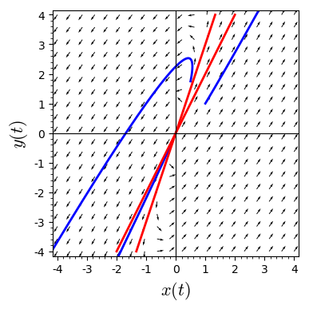

```python
x, y, t = var('x y t') #declare the variables
F = [4*x - 1*y, 6*x - 1*y] #declare the system
# normalize the vector fields so that all of the arrows are the same length
n = sqrt(F[0]^2 + F[1]^2)
# plot the vector field
p = plot_vector_field((F[0]/n, F[1]/n), (x, -4, 4), (y, -4, 4), aspect_ratio = 1)
# solve the system for the initial condition t = 0, x = 1, y = 1
P1 = desolve_system_rk4(F, [x, y], ics=[0, 1, 1], ivar = t, end_points = 5, step = 0.01)
P2 = desolve_system_rk4(F, [x, y], ics=[0, 0.5, 1.75], ivar = t, end_points = 5, step = 0.01)
P3 = desolve_system_rk4(F, [x, y], ics=[0, -0.1, -.25], ivar = t, end_points = 5, step = 0.01)
# grab the x and y values
S1 = [ [j, k] for i, j, k in P1]
S2 = [ [j, k] for i, j, k in P2]
S3 = [ [j, k] for i, j, k in P3]
# plot the solution
# Setting xmin, xmax, ymin, ymax will clip the window
# Try plotting without doing this to see what happens
p += line(S1, thickness = 2, axes_labels=['$x(t)$','$y(t)$'], xmin = -4, xmax = 4, ymin = -4, ymax = 4) 
p += line(S2, thickness = 2, axes_labels=['$x(t)$','$y(t)$'], xmin = -4, xmax = 4, ymin = -4, ymax = 4) 
p += line(S3, thickness = 2, axes_labels=['$x(t)$','$y(t)$'], xmin = -4, xmax = 4, ymin = -4, ymax = 4) 
# plot the straightline solutions
p += line([(-2, -4), (2, 4)], thickness = 2, color = "red") 
p += line([(-4/3, -4), (4/3, 4)], thickness = 2, color = "red")
p
```





```python

```
