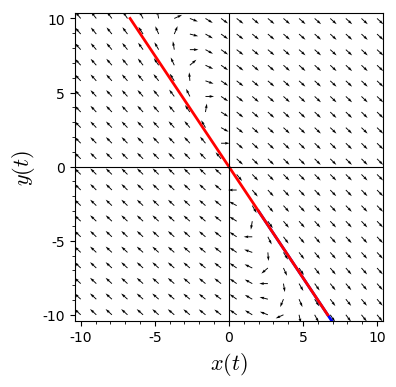

```python
x, y, t = var('x y t') #declare the variables
F = [9*x + 4*y, -9*x - 3*y] #declare the system
# normalize the vector fields so that all of the arrows are the same length
n = sqrt(F[0]^2 + F[1]^2)
# plot the vector field
p = plot_vector_field((F[0]/n, F[1]/n), (x, -10, 10), (y, -10, 10), aspect_ratio = 1)
# solve the system for the initial condition t = 0, x = -2, y = 5
P1 = desolve_system_rk4(F, [x, y], ics=[0, 2, -3], ivar = t, end_points = 5, step = 0.01)
# grab the x and y values
S1 = [ [j, k] for i, j, k in P1]
# plot the solution
# Setting xmin, xmax, ymin, ymax will clip the window
# Try plotting without doing this to see what happens
p += line(S1, thickness = 2, axes_labels=['$x(t)$','$y(t)$'], xmin = -10, xmax = 10, ymin = -10, ymax = 10)
# plot the straightline solutions
p += line([(-20/3, 10), (20/3, -10)], thickness = 2, color = "red") 
p
```





```python

```


```python

```
